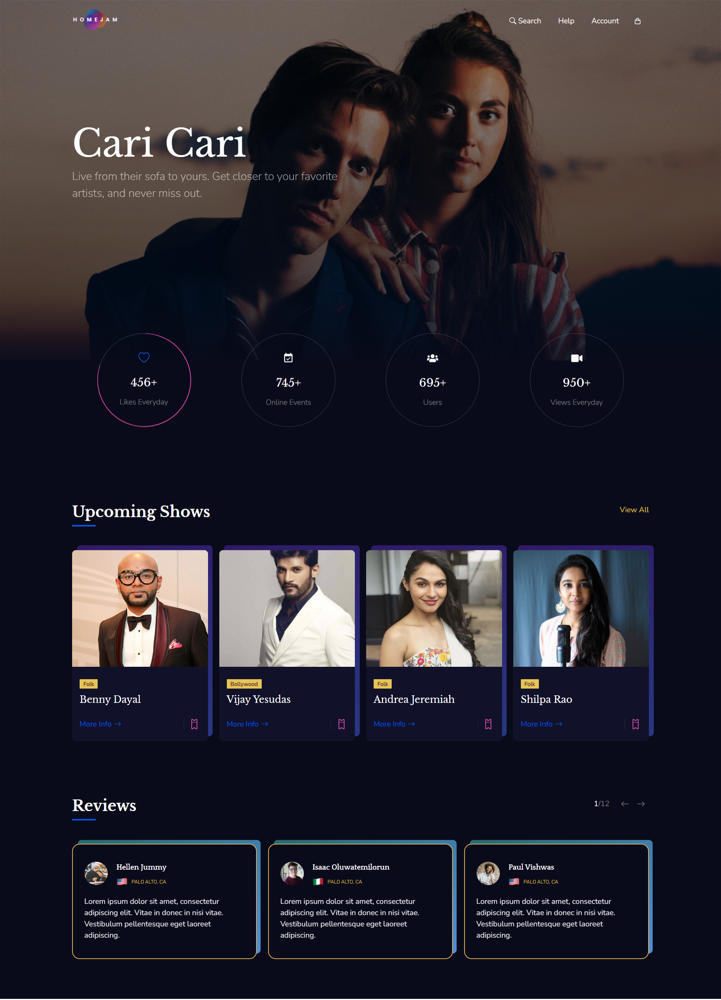

<p align='center'>

</p>
<p align='center'>
<b>A single-page application based on Homejam's homepage built using React.js</b>
</p>
<p align='center'>
<a href='https://homejam-clone.netlify.app/' target='_blank'>homejam-clone.netlify.app</a>
</p>

---

<p align='center'>
This is the frontend of Homejam build with React.js and deployed with <a href='https://www.netlify.com/' target='_blank'>Netlify</a>
</p>

<p align='center'>

</p>

## 🧾 Description

This is the mock homepage of Homejam built with React.js for the Versai Internship in Frontend Development.

## ⚙ Tools and Technologies used

1. [React.js](https://reactjs.org/)
2. [React-icons](https://react-icons.github.io/react-icons/)
3. [Styled-Components](https://styled-components.com/)

## 🛠 Installation and setup

1. Clone the repo to your local machine.
2. Install the required dependency for server using :

   ```javascript
   npm install
   ```

3. Start the dev server using :

   ```javascript
   npm start
   ```

## 🏎 Creating production built

1. Create a production ready react app using the command :

   ```javascript
   npm run build
   ```
